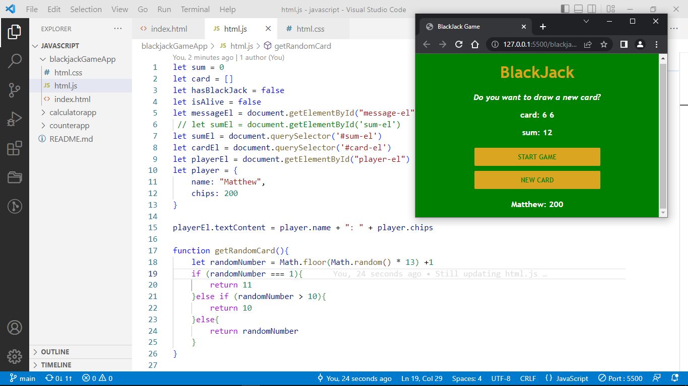

# BLACKJACK GAME APP

Blackjack is a classic casino game of luck and strategy, the most widely played casino banking game in the world, well this is a version

# WHAT'S PROVIDED

## STARTGAME

You are give two random numbers which the app generate

## HOW YOU WIN

The total cards you draw must equal 21, there are some arimethetic operations done here to achieve some rules the game has

## DRAW NEW CARD

So you are required to draw a new card if and only if you the sum of the card on your deck is not greater or equal to 21

