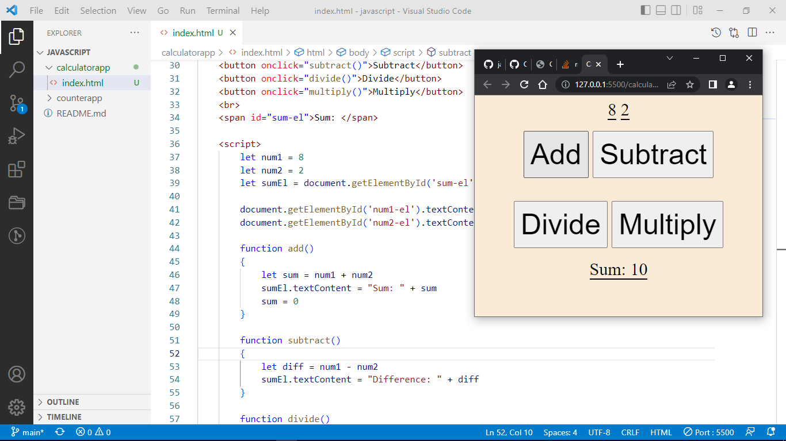
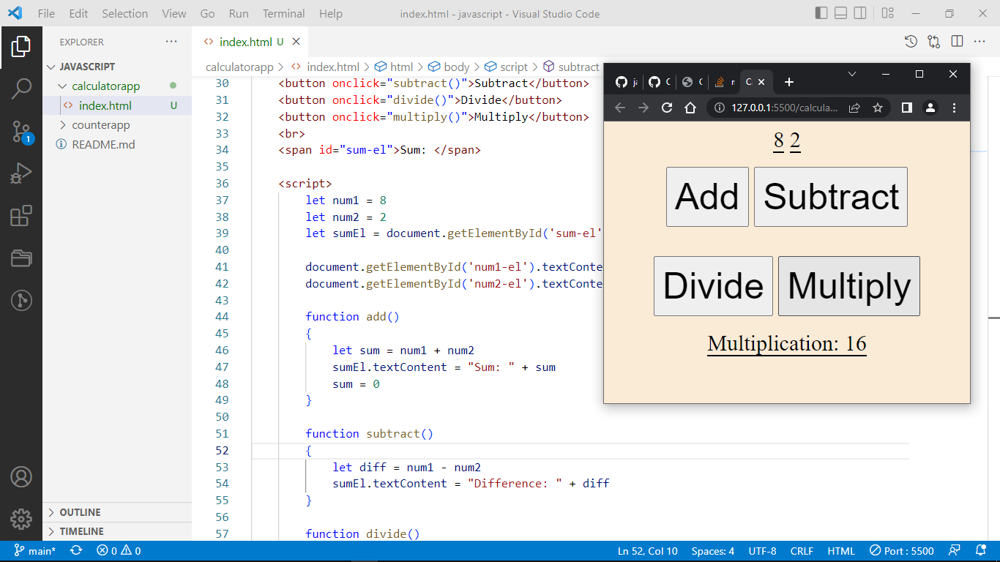

# CALCULATOR APP

This App uses arithmetic function to provide simple mathematical calculations such as Addition, Subtraction, Multiplication and Division 

# FUNCTIONS IT PROVIDES

## ADDITION

Adding of two numbers such as "(x + y) = z" the illustration below is just how I made it look like

## SUBTRATION

Subtracting of two numbers such as "(x - y) = z" the illustration below is just how I made it look like

## DIVISION

Diving of two numbers such as "(x / y) = z" the illustration below is just how I made it look like

## MULTIPLICATION

Multiplying of two numbers such as "(x * y) = z" the illustration below is just how I made it look like

